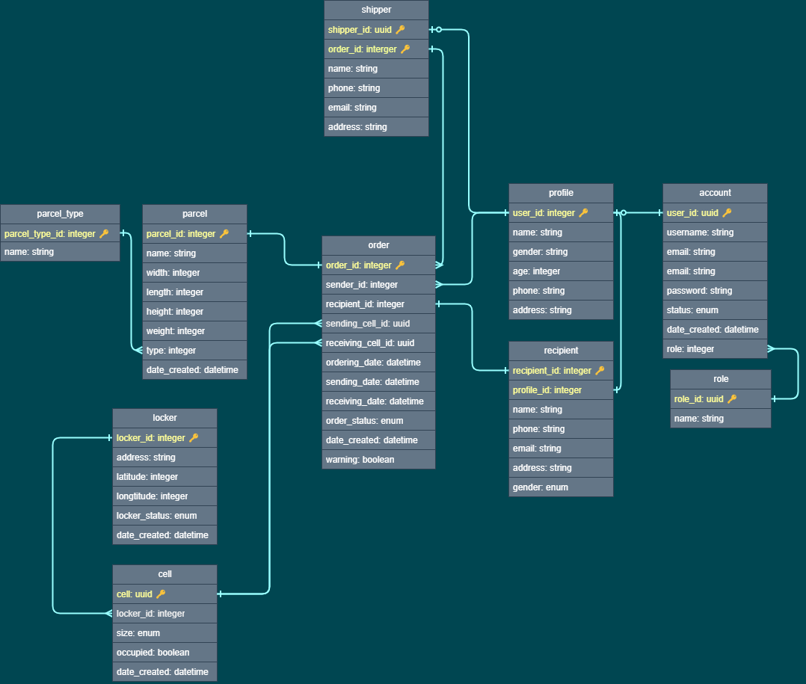

# Backend of Parcel Locker

# Table of Content

- [Description](#description)
- [Tools and Languages](#tools-and-languages)
- [Install](#install)
- [Migration](#migration)
- [MoSCoW Analysis](#moscow-analysis)
- [Schema Design](#schema-design)

## Description

A parcel locker, also known as a package locker or self-service delivery kiosk, is an automated system that allows for secure and convenient storage and delivery of packages. Essentially, it's like a giant vending machine for your parcels.

Parcel lockers are becoming increasingly popular as online shopping and delivery services grow. They offer a convenient and flexible solution for both individuals and businesses looking for a secure and efficient way to receive and send packages.

## Tools and Languages

- Backend

## Install

- Create virtual environment: python `python3 -m venv venv`
- Activate virtual environment: `/venv/Scripts/activate`
- Install all dependenies: `pip install -r requirements.txt`

## Migration

- Initiate alembic: `alembic init alembic`
- Migrate new update: `alembic revision --autogenerate -m "{changes}"`
- Allply migration (deployment): `alembic upgrade head`

## MoSCoW Analysis

<!-- markdownlint-disable MD033 -->
### 1. Must-have features
<!-- markdownlint-enable MD033 -->

- Account and Authentication: Users should be able to create accounts and verify their identity (ID) for secure access to lockers. Consider two-factor authentication for added security. (Text message codes, Email verification, PIN codes,...)

- Find Locker: Implement a map-based search with clear filters like size, location, and availability. Real-time updates on locker availability are essential.
Locker Booking and Management: Users should be able to browse available lockers near them, choose sizes, book them for specific time slots, and extend durations if needed.

- Delivery Management (Receive Parcel): Users should be able to provide delivery instructions (e.g., locker ID, access code) for couriers or designate friends/family to pick up items. Integration with popular courier services could be a nice addition.

- Payment and Billing: Offer secure payment options for booking lockers and any additional services (e.g., extended storage, insurance).

- Tracking and Notifications: Users should be able to track their parcels within the app, receive notifications about deliveries and pickups, and manage access codes

<!-- markdownlint-disable MD033 -->
### 2. Should-have features
<!-- markdownlint-enable MD033 -->

- Manage Account: Users should be able to view their delivery history, update preferences, and manage payment methods. Secure login and account management are essential.
- Map Integration: Show users locker locations on a map with directions or navigation functionalities.
- Size and Price Variations: Offer different locker sizes with varying prices based on size and duration.
- Customer assist: Support chat box or hotline for emergence or quick assistance.

<!-- markdownlint-disable MD033 -->
### 3 Could-have features
<!-- markdownlint-enable MD033 -->

- Community Features: Allow users to rate locker locations, leave reviews, or report issues.
- Group Locker Sharing: Allow friends or family to share a locker for joint deliveries, simplifying group orders or gift exchanges.
- Rewards: Implement a loyalty program with points for frequent use, unlocking discounts or VIP features. (like Shopee, Lazada,...)

<!-- markdownlint-disable MD033 -->
### 4 Won’t-have features (good features which should be implement and develop in the future)
<!-- markdownlint-enable MD033 -->

- Advanced Security: Implement features like tamper-proof locks, video surveillance, and activity logs for enhanced security.
Scalability and Partnerships: Consider the possibility of expanding your network of lockers and partnering with businesses or apartment complexes for wider reach.
- Locker Temperature Control: Offer temperature-controlled lockers for sensitive items like food or medication.
- Interactive locker screens: Display personalized greetings, weather updates, or local store promotions on locker screens.
- Delivery drones:Using drones for delivering light and emergency packages.
- Virtual assistant:
  - Voice-Activated Navigation: Users can navigate the app entirely through voice commands.
  - Clear and Concise Audio Instructions: provides clear and concise audio instructions for every step of the process.

## Schema Design

## Screenshots

Include screenshots or GIFs showcasing the app's functionality.

## Installation

Provide instructions on how to install the app.

## Usage

Explain how to use the app and provide examples if necessary.

## Contributing

### Frontend Team

- UI/UX Designer: Pham Nguyen Quynh Anh, Nguyen Ngoc Gia Linh
- Mobile app developer:

### Backend Team

- Backend Developers: Nguyen Hoang Hong An, Nguyen Minh Quan, Pham Thi Cam Nhung

## License

This project is licensed under the [MIT License](LICENSE).

## Contact

- Your Name
- Your Email
- Any other contact information you want to provide
